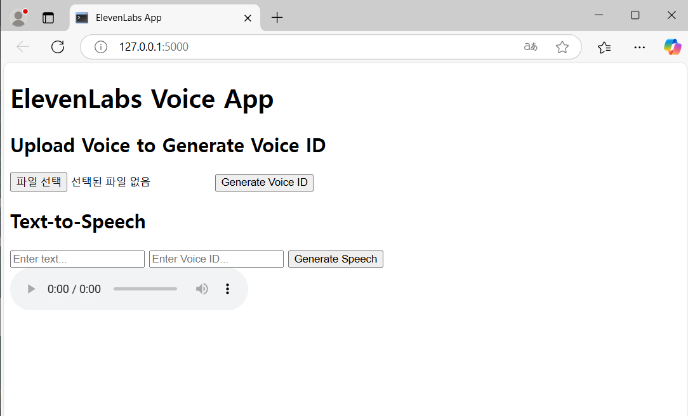
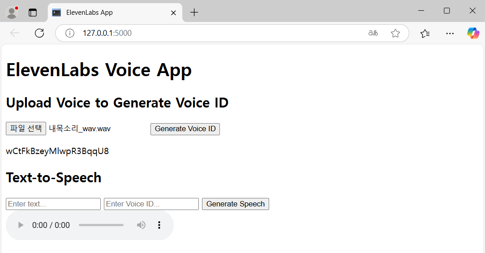
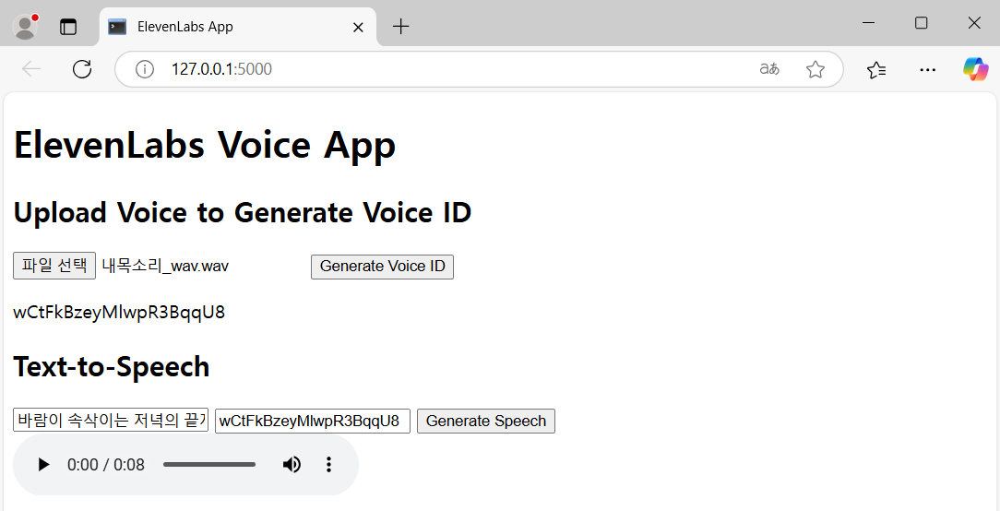
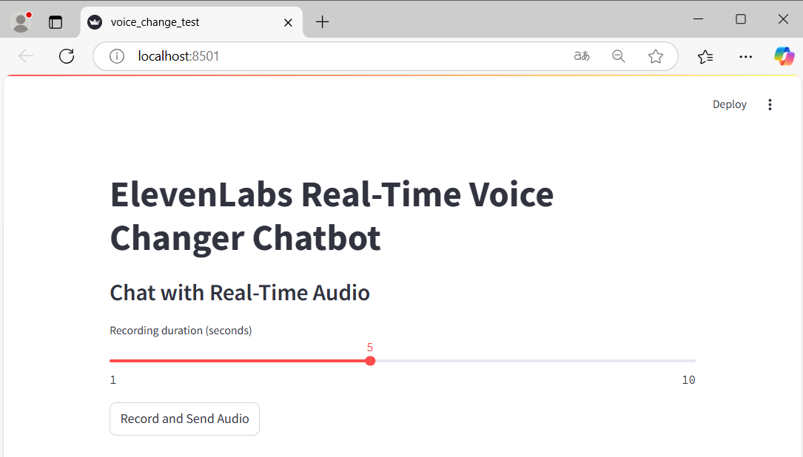
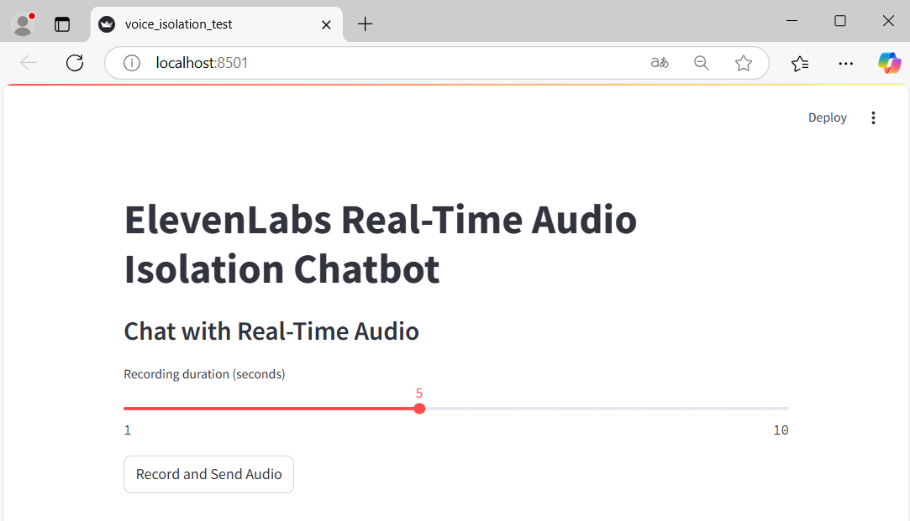
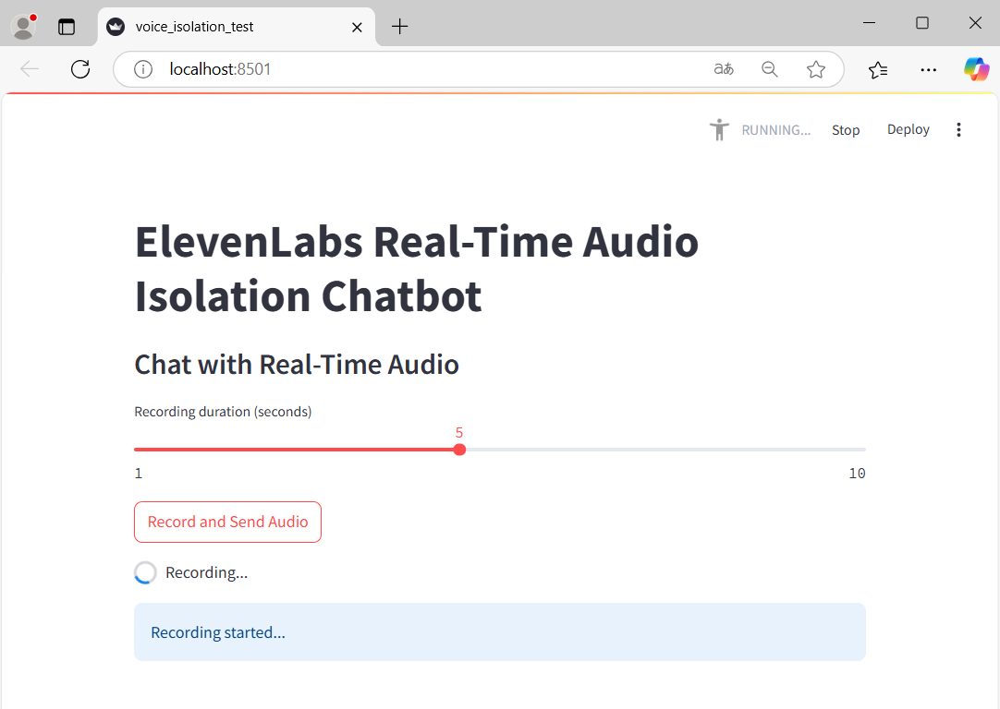
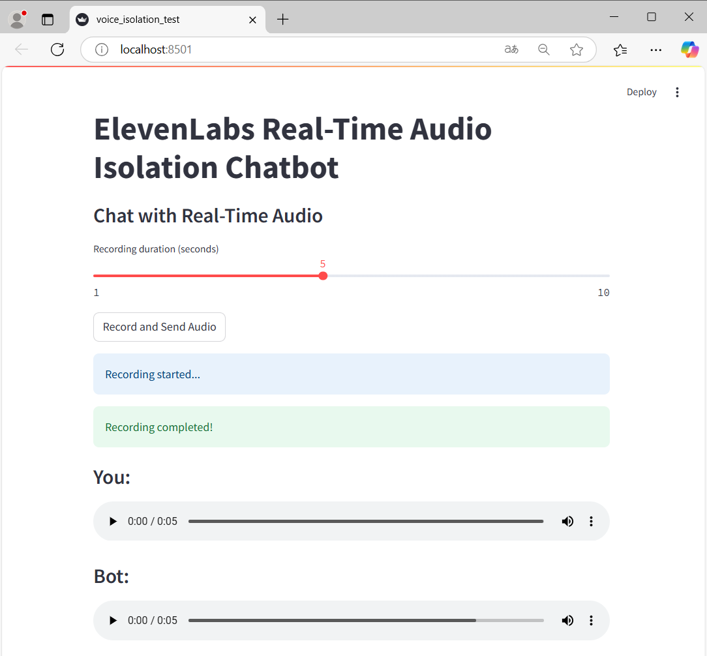

# Audio (Voice) Processing Projects 🎙️🔊

An advanced set of tools for processing and transforming voice data using AI-powered APIs. This repository includes three main projects:
1. **Voice ID & TTS Conversion** (`voiceID_tts_test.py`)
2. **Background Noise Removal** (`voice_isolation_test.py`)
3. **Voice Modification** (`voice_change_test.py`)

Each project is designed to enhance and modify audio in unique ways.

<table>
<tr>
    <td align="center">
        <h3>Voice ID & TTS</h3>
        
    </td>
    <td align="center">
        <h3>Noise Isolation</h3>
        
    </td>
</tr>
<tr>
    <td align="center">
        <h3>Voice Change</h3>
        
    </td>
</tr>
</table>

<table>
<tr>
    <td align="center">
        <h3>Voice ID & TTS</h3>
        
    </td>
    <td align="center">
        <h3>Noise Isolation</h3>
        
    </td>
</tr>
<tr>
    <td align="center">
        <h3>Voice Change</h3>
        
    </td>
</tr>
</table>

<table>
<tr>
    <td align="center">
        <h3>Voice ID & TTS</h3>
        
    </td>
    <td align="center">
        <h3>Noise Isolation</h3>
        
    </td>
</tr>
<tr>
    <td align="center">
        <h3>Voice Change</h3>
        
    </td>
</tr>
</table>

<details>
<summary>README (한국어)</summary>

## 주요 기능 ✨
- **Voice ID 생성**: 업로드된 음성을 기반으로 고유 Voice ID를 생성.
- **TTS 변환**: Voice ID를 이용하여 입력된 텍스트를 음성으로 변환.
- **배경 소음 제거**: 음성에서 불필요한 소음을 제거하여 깨끗한 오디오 제공.
- **음성 변환**: 입력된 목소리를 특정 스타일이나 다른 음성으로 변환.

## 환경 변수 설정 ⚙️
- `.env` 파일을 생성한 후 다음과 같이 API 키를 입력하세요.
  ```ini
  ELEVENLABS_API_KEY=your_api_key_here
  ```

## 기여 방법 🤝
1. 이 저장소를 포크합니다.
2. 새로운 브랜치를 생성합니다: ```git checkout -b feature/your-feature-name```
3. 변경 사항을 커밋합니다: ```git commit -m 'Add some feature'```
4. 브랜치에 푸시합니다: ```git push origin feature/your-feature-name```
5. 풀 리퀘스트를 생성합니다.

## 라이선스 📝
이 프로젝트는 MIT 라이선스를 따릅니다. 자세한 내용은 [LICENSE](./LICENSE)를 참조하세요.
</details>

---

<details> <summary>README (English)</summary>
  
## Key Features ✨
- **Voice ID Generation**: Creates a unique Voice ID from uploaded audio.
- **Text-to-Speech Conversion**: Uses Voice ID to convert input text into speech.
- **Noise Isolation**: Removes unwanted background noise for cleaner audio.
- **Voice Modification**: Transforms input voice into a different style or tone.

## Environment Variables ⚙️
- Create a `.env` file and add the following API key:
  ```ini
  ELEVENLABS_API_KEY=your_api_key_here
  ```

## Contribution 🤝
1. Fork this repository.
2. Create a new branch: ```git checkout -b feature/your-feature-name```
3. Commit your changes: ```git commit -m 'Add some feature'```
4. Push to the branch: ```git push origin feature/your-feature-name```
5. Open a pull request.

## LICENSE 📝
This project is licensed under the MIT License. See [LICENSE](./LICENSE) for more details. 
</details>


